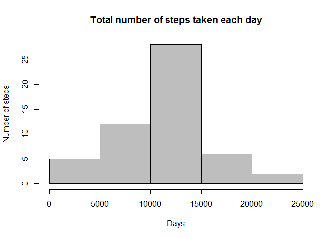
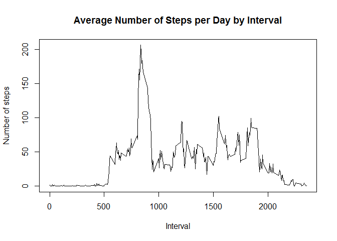
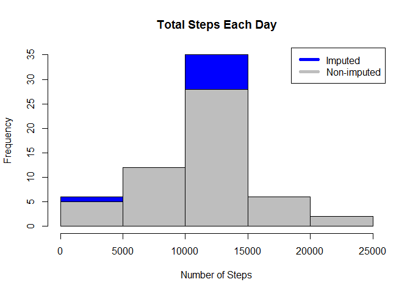

# Reproducible Research: Peer Assessment 1
Gnaneshwar G  
Sunday, July 19, 2015  

#Loading and preprocessing the data

```r
AMData <- read.csv("repdata_data_activity/activity.csv")
```

#What is mean total number of steps taken per day?
###1.Calculate the total number of steps taken per day

```r
library(plyr)
```

```
## Warning: package 'plyr' was built under R version 3.1.3
```

```r
StepsPerDay <- aggregate(steps~date,data = AMData,FUN = sum)
```

###2.Make a histogram of the total number of steps taken each day

```r
hist(x = StepsPerDay$steps,
     xlab = "Days",
     ylab = "Number of steps",
     main = "Total number of steps taken each day",
     col = "grey")
```

 

###3.Calculate and report the mean and median of the total number of steps taken per day

```r
rmean <- mean(StepsPerDay$steps)
rmedian <- median(StepsPerDay$steps)
```

#What is the average daily activity pattern?
###1.Make a time series plot of the 5-minute interval (x-axis) and the average number of steps taken, averaged across all days (y-axis)

```r
StepsPerInterval <- aggregate(steps~interval,data = AMData,FUN = mean)
plot(StepsPerInterval$interval,StepsPerInterval$steps,
     type = "l",
     xlab = "Interval",
     ylab = "Number of steps",
     main = "Average Number of Steps per Day by Interval")
```

 

###2.Which 5-minute interval, on average across all the days in the dataset, contains the maximum number of steps?

```r
MaxInterval <- StepsPerInterval[which.max(StepsPerInterval$steps),1]
```

#Imputing missing values

```r
TotalNA <- nrow(AMData[is.na(AMData$steps),])
imputed_data <- transform(AMData, steps = ifelse(is.na(AMData$steps), StepsPerInterval$steps[match(AMData$interval, StepsPerInterval$interval)], AMData$steps))
imputed_data[as.character(imputed_data$date) == "2012-10-01", 1] <- 0
steps_by_day <- aggregate(steps ~ date, imputed_data, sum)
hist(steps_by_day$steps, main = "Total Steps Each Day", col="blue", xlab="Number of Steps")
hist(StepsPerDay$steps, main = "Total Steps Each Day", col="grey", xlab="Number of Steps", add=TRUE)
legend("topright", c("Imputed", "Non-imputed"), col=c("blue", "grey"), lwd=5)
```

 

Calculate new mean and median for imputed data. Then calculate difference between imputed and non-imputed data. Find the total difference

```r
rmean.i <- mean(steps_by_day$steps)
rmedian.i <- median(steps_by_day$steps)
mean_diff <- rmean.i - rmean
med_diff <- rmedian.i - rmedian
total_diff <- sum(steps_by_day$steps) - sum(StepsPerDay$steps)
```

- The imputed data mean is 1.0589694\times 10^{4}
- The imputed data median is 1.0766189\times 10^{4}
- The difference between the non-imputed mean and imputed mean is -176.4948964
- The difference between the non-imputed mean and imputed median is 1.1886792
- The difference between total number of steps between imputed and non-imputed data is 7.5363321\times 10^{4}.

#Are there differences in activity patterns between weekdays and weekends?

```r
weekdays <- c("Monday", "Tuesday", "Wednesday", "Thursday","Friday")
imputed_data$dow = as.factor(ifelse(is.element(weekdays(as.Date(imputed_data$date)),weekdays), "Weekday", "Weekend"))
steps_by_interval <- aggregate(steps ~ interval + dow, imputed_data, mean)
library(lattice)
xyplot(steps_by_interval$steps ~ steps_by_interval$interval|steps_by_interval$dow, main="Average Steps per Day by Interval",xlab="Interval", ylab="Steps",layout=c(1,2), type="l")
```

 


